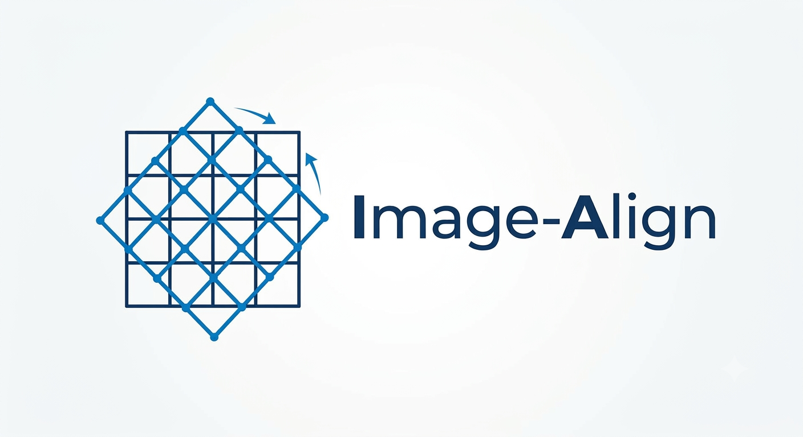

## image-align 
This is a package to resample and coadd astronomical images (tested with .fits format).
The code uses swarp to resample the images and coadd. 
<p align="center">
  
</p>


### Installation

For a mac , install swarp with 

```
sudo port install swarp
```

For linux based systems, consult the detailed installation in their manual.

After swarp install - 

```
pip install -e .

```

### Usage

```
image-align align_config.yml      
```
If you need precise aligning, make sure to use `precise_align: False`
```
image-align align_config.yml --gaia --sex --scamp
```
If you want to generate diagnostic images 
```
 image-align align_config.yml --check_align
 image-align align_config.yml --gaia --sex --scamp --check_align
 ```


### Detailed usage
Edit the _config.yml_ file and give the diredtory path. 
The directory should contain images taken with the same filter. 

The fits file obtained after coaddition would be tagged with a suffix _coadd.fits_

The configs for swarp are kept in `configs/astromatic`. 

For more information on swarp, visit - 
[Swarp](https://www.astromatic.net/software/swarp/)

### Future developments

- [x] Astrometry fine tuning.
- [x] tests.
- [x] logging.
- [] Add type hinting.

This package is being developed for performing deep stacking of images of supernovae in the late phase from ground based telescope. 